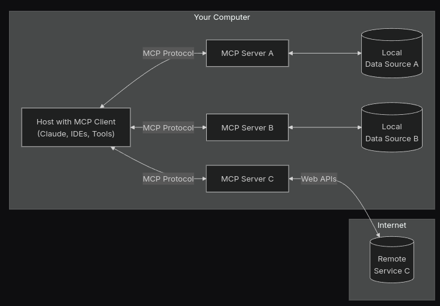

:revealjsdir: ../node_modules/reveal.js
:revealjs_customtheme: ../theme/vsfi.css
:revealjs_showSlideNumber: all
:source-highlighter: highlightjs
:highlightjs-languages: yaml, bash

= ИИ помощник для разработчика

Кретов Илья

2025

== Что это такое и зачем нужно

Использование ИИ и LLM возможно в самых разных сферах человеческой жизни.
Мы с вами программисты и нас интересует использование ИИ в разработке программного обеспечения.

[.notes]
--
- все слышали про искусственный интеллект
- хайп, огромные деньги и надежды
- скорость развития впечатляет - если первая БЯМ обучалась на корпусе текстов из примерно миллиарда слов (985 млн), то сейчас это сотни миллиардов или даже триллионы токенов. Анализ 2020 года показал, что возможности нейронных языковых моделей (измеряемые функцией потерь при обучении) плавно увеличивались по степенному закону от количества параметров, количества обучающих данных и вычислений, используемых для обучения. Эти связи были проверены в широком диапазоне значений (до семи порядков), и не наблюдалось затухания отношения на верхнем конце диапазона (в том числе для размеров сети до триллионов параметров).
- резко обострившаяся конкуренция в сфере разработки LLM и ИИ помощников, особенно после выхода на рынок китайских решений: все более доступные и мощные модели; перспектива появления достаточно качественных и бесплатных решений в самом ближайшем будущем, что вселяет определенную надежду.
--

=== Что такое ИИ помощник

ИИ помощник - это программа, которая помогает разработчику в его повседневной работе.
Вы даете ему контекст, ставите задачу и он, на основе полученных вводных генерирует код.
Современные продвинутые помощники умеют запускать приложение, проверять результаты и корректировать код в зависимости от того, что увидели в логах или даже на экране браузера.

[.notes]
--
- помощник может быть как встроенным в к-л существующее IDE, так и поставляться отдельным приложением
- может быть в десктоп версии, так и в облаке
- помощник может предлагать варианты исправления ошибок, автоматически генерировать код, анализировать код и многое другое
- есть разные режимы работы помощников, разные способы генерации кода и проверки ошибок в зависимости от вендора решения
- очень хорош для решения рутинных задач, типа добавления справочников. но если требуется что-то нетривиальное... он решение предложит, но не факт, что оно будет оптимальным или даже просто правильным
- качество получаемого кода, при прочих равных, очень сильно зависит от того насколько хорошо вы напишете промпт и дадите весь необходимый контекст   
-- 

=== Основные задачи ИИ помощника
[%step]
* Создание кода

[%step]
* Автодополнение кода

[%step]
* Генерация документации

[%step]
* Написание тестов

[%step]
* Анализ кода

[%step]
* Рефакторинг

[.notes]
--
- анализ документов и генерация кода на их основе или на основе "prompt"
- спецификации OpenAPI, диаграммы UML в формате PlantUML на основе кода, README.md
- если код достаточно хорошо спроецирован в смысле того самого SOLID, то генерация тестов штука достаточно простая
- анализ кода на предмет ошибок, уязвимостей, неоптимальных мест. код ревью! хорошо находит грамматические ошибки и даже некоторые семантические
- рефакторинг сам не тестировал активно
--

=== Существующие варианты

- Copilot от GitHub
- Claude от Anthropic
- Cursor
- Bolt
- Trae (ByteDance)

[.notes]
--
кроме них еще есть:
- Tabnine, Continue, CodeWhisperer (AWS), Codeium, Bard (Google)
- какие то идут как отдельное приложение, какие-то как плагины к IDE, какие-то как облачные сервисы 
- Trae выглядит относительно многообещающе, но пока там нет версии под линукс. Похожий ну Курсор подход.
--

=== GitHub Copilot (от GitHub/Microsoft)
[%step]
* *Плюсы*
** хорошая интеграция с IDE и низкий порог входа
** контекстные подсказки в реальном времени
** бесплатный доступ для пользователей GitHub
* *Минусы*
** платная подписка 
** закрытый исходный код

=== Claude  (от Anthropic)
[%step]
* *Плюсы*
** высокое качество генерируемого кода
** Computer Use
* *Минусы*
** ограниченная интеграция с IDE
** относительно высокая стоимость

[.notes]
--
- надо понимать, что когда говорим Claude, то понимаем как Cline с моделью Sonnet 3.5 под капотом
--

=== Cursor
[%step]
* *Плюсы*
** открытый исходный код
** бесплатный
** работает с любыми репозиториями
* *Минусы*
** находится в активной разработке
** не дает столь же качественный код, как Claude (*)

[.notes]
--
- (*) - на момент тестирования. Нужно заметить, что и Copilot, и Cursor 
могут использовать языковую модель Sonnet 3.5 - признанный лидер по качеству генерации кода.
- сам пока что не попробовал, планирую в ближайшее время. Там есть бесплатный период.
--

=== Остальные решения
* Bolt от Stackblitz
* AI Assistant от JetBrains
* Trae от ByteDance

[.notes]
--
- Bolt: ограничен бесплатными токенами, быстрый, и исключительно хорош для небольших облачных веб проектов
- AI Assistant: активно развивается, использует Claude Sonnet 3.5
--

== Как работает ИИ помощник
С помощью промптов и контекста вы говорите модели, что от неё требуется и она генерирует код.
Чем больше контекста дать тем качественнее будет код.

[.notes]
--
- относитесь к нему как к очень старательному стажеру, который не знает ничего о вашем проекте, но очень начитан, быстро генерит код и не устает
- чем больше данных вы ему дадите на входе и чем более подробными будут инструкции тем качественнее результат.
- надо держать в голове, что повторение результатов даже при идентичных вводных не гарантировано - demo-movies-db двух версий тому живой пример.
--


== Живая демонстрация возможностей Claude/Cline

Работа Claude в связке с VSCode+Cline.
Задача: написать небольшую программу, которая будет вести базу данных фильмов в коллекции.

Prompt:
```
Using sqlite and nodejs + express write backend for handling movies DB.
Db should contain entity "movie" with properties: 
- title
- year
- awards
- studio name
- producer 
- actors as a comma-separated string list
```

[.notes]
--
- запустить
- попросить создать тестовую запись в базе и тут же вернуть полный список
--

== Серверы MCP 



MCP servers это средство для расширения возможностей Cline и Claude Desktop.

[.notes]
--
- Например, можно с помощью MCP servers предоставить Claude read/only доступ к базе данных.
- integration with JetBrains IDE : https://plugins.jetbrains.com/plugin/26071-mcp-server
- Atlassian : https://github.com/sooperset/mcp-atlassian
- демонстрация возможностей: PostgreSQL MCP : https://github.com/modelcontextprotocol/servers/tree/main/src/postgres
- рассказать об опыте использования Obsidian MCP
--

== DeepSeek-R1, Qwen 2.5, Chat GPT o3-mini

* DeepSeek : https://www.deepseek.com/
* o3-mini : https://openai.com/index/openai-o3-mini/
* Qwen 2.5 : https://github.com/QwenLM/Qwen2.5
* локальный запуск LLM : https://habr.com/ru/companies/ncloudtech/articles/878096/

[.notes]
--
- решил добавить небольшую секцию по текущим тенденциям и событиям. Пока готовил презентацию произошло достаточно много событий в этой области и просто нельзя было не упомянуть
- DeepSeek - новый проект от малоизвестной компании, занимающейся разработкой решений для трейдинга. Ходят слухи, что он стащили модель от OpenAI и дополнительно её обучили. Стоимость решения какая-то исключительно низкая, особенно на фоне лидеров типа OpenAI (вышло дешевле, чем зарплата 1 члена правления). Обрушили рынок, как следствие получили очень нервную и резкую реакцию, впоть до запрета приложения в маркетах и судебные преследования.
- Qwen 2.5 вышла чуть позже, буквально неделю назад. Заявляют о лучшей производительности чем у DeepSeek.
- и еще дня через три вышел o3-mini от OpenAI. Практически во всех бенчмарках - от математики и программирования, и до ответов на вопросы для докторов наук o3-mini (в режиме high) показывает результаты практически идентичные текущей самой мощной (из доступных) моделей OpenAI: o1. В тестах по разработке даже чуть выше
- поддавшись хайпу я на домашнем сервере запустил локально DeepSeek-R1 (4.5 GB size) и gpt-mini. Попросил обе написать игру "крестики нолики". Результаты откровенно никакие. ГПТ правильно отрисовал игровое поле, но джаваскрипт вообще не работал и был весьма неполным. Дипсик чуть лучше, но колонки выстроились в одну колонку. При попытке довести до рабочего состояния llama сначала как следует нагрела машину, а потом и перезагрузила. Соннет справился на твердую пятерку, но не с первой попытки, впрочем - со второго промпта. Примеры можно найти в репозитории (показать).
--

== Спасибо

== Ссылки

=== Статьи на тему Claude / Cline & Cursor

- Virtual Collaborators - анонс от основателя Anthropic : https://the-decoder.com/anthropic-ceo-expects-major-ai-breakthrough-plans-to-launch-virtual-collaborators/

- Как Claude от Anthropic меняет правила игры для разработчиков программного обеспечения : https://habr.com/ru/companies/bothub/news/869104/

- Google вкладывает еще 1 $Bln : https://habr.com/ru/news/875606/ 

- Computer use : https://www.youtube.com/watch?v=VDmU0jjklBo

=== Статьи на тему Copilot

- GitHub Copilot : https://habr.com/ru/articles/674658/

- Как использовать GitHub Copilot в IDE: советы, приёмы и лучшие практики (перевод) : https://habr.com/ru/companies/otus/articles/815083/ ( оригинал статьи: https://github.blog/developer-skills/github/how-to-use-github-copilot-in-your-ide-tips-tricks-and-best-practices/ )

=== Cursor

- The Ultimate Introduction to Cursor for Developers : https://www.builder.io/blog/cursor-ai-for-developers

- Как ИИ-ассистенты меняют правила игры в разработке ПО — на примере Cursor - https://habr.com/ru/companies/inferit/articles/869880/

=== Статьи на тему продуктов OpenAI

- Ваша онлайн-жизнь под контролем ИИ: OpenAI запускает «Operator» : https://www.securitylab.ru/news/555727.php 

=== MCP

- https://modelcontextprotocol.io/introduction

- https://github.com/modelcontextprotocol/servers?tab=readme-ov-file

- https://github.com/punkpeye/awesome-mcp-servers?tab=readme-ov-file


=== Prompt ingeneering 

- Описание личного опыта и практик работы с ИИ помощником : https://crawshaw.io/blog/programming-with-llms

- Довольно долгий подкаст на тему промптинга : https://www.youtube.com/watch?v=T9aRN5JkmL8

- Промптинг: действительно полезное руководство : https://habr.com/ru/articles/865952/

=== Прочие статьи

- LLM Leaderboard : https://huggingface.co/spaces/lmarena-ai/chatbot-arena-leaderboard

- Автогенерация тестов для Java/Kotlin в IntelliJ IDEA: сравнение AI-инструментов : https://habr.com/ru/companies/explyt/articles/869198/

- Неплохой обзор на Реддите : https://www.reddit.com/r/ChatGPTPro/comments/1bdxiur/top_ai_code_assistant/?rdt=33043

- Я 8 часов тестировал модель o1 Pro за 200$ и сравнил ее с Claude Sonnet 3.5 за 20$ - https://habr.com/ru/articles/866168/

- Топ-20 лучших научных статей об ИИ-агентах в 2024 году : https://habr.com/ru/articles/871104/

- ChatGPT и его конкуренты: обзор пяти текстовых нейросетей : https://www.ixbt.com/live/sw/chatgpt-i-ego-konkurenty-obzor-pyati-tekstovyh-neyrosetey.html

- 40 лучших ИИ-инструментов 2025 году (проверенные и протестированные) : https://habr.com/ru/articles/871268/ 

- Killed by LLM (Разработчик представил проект Killed by LLM, где опубликованы бенчмарки, которые были побеждены прогрессом ИИ) : https://habr.com/ru/news/871838/ 

- Claude сопротивляется : https://habr.com/ru/articles/869498/

- Горькая правда о программировании с использованием ИИ : https://addyo.substack.com/p/the-70-problem-hard-truths-about

- Ссылка на тикет в Youtrack AI Assistant : https://youtrack.jetbrains.com/issue/LLM-2402/Integrate-Claude.ai-LLM-models-with-AI-Assistant#focus=Change-27-11379104.0-0.pinned

